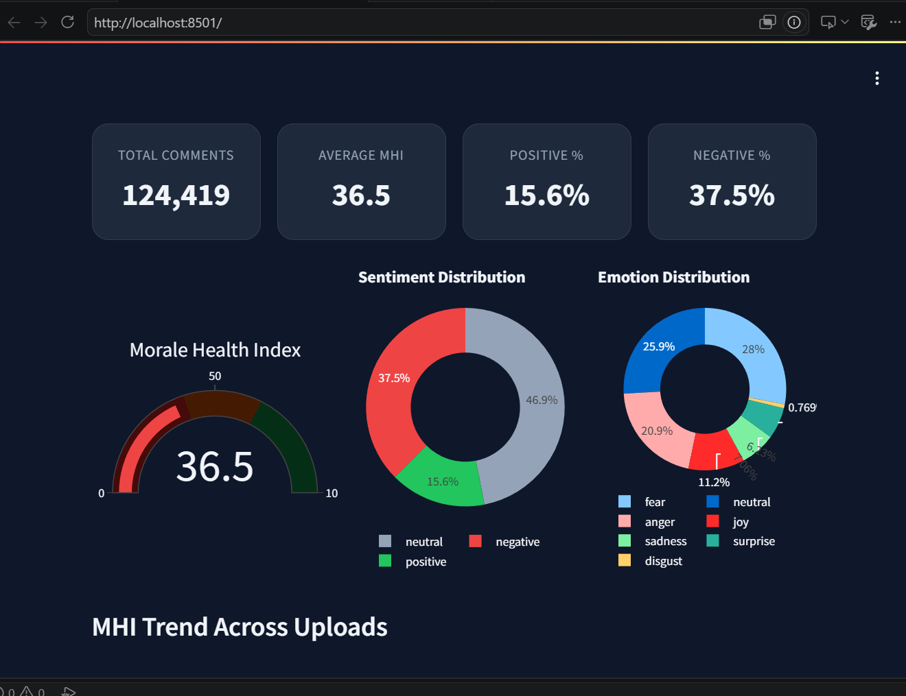

# Morale Health Index Dashboard

This project analyzes employee/social media text data using sentiment and emotion labels to calculate a **Morale Health Index (MHI)**.

The dashboard allows users to upload a CSV or Excel file and automatically generates visualizations, summary statistics, and AI-generated insights.

---

## Features

- Upload CSV/XLSX datasets
- Morale Health Index (MHI) calculation
- Sentiment distribution analysis
- Emotion distribution analysis
- Interactive dashboard with charts
- Summary statistics
- AI-generated insights using Groq LLaMA *(requires API key)*

---

## Input File

The dashboard accepts CSV or Excel files containing the following columns:

| Column | Required |
|---------|----------|
| `text` | ✅ |
| `sentiment` | ✅ |
| `emotion` | ✅ |
| `mhi_score` | ✅ |

Once the dataset is uploaded, click **Analyze**. The dashboard automatically calculates the Morale Health Index, generates visualizations, and displays AI insights (if a valid API key is configured).

---

# Dashboard

## Upload Page


The user uploads a CSV or Excel file containing sentiment and emotion data.

---

## Dashboard Output



The dashboard displays:

- Total Comments
- Average Morale Health Index
- Positive and Negative Percentage
- Sentiment Distribution
- Emotion Distribution
- MHI Gauge
- MHI Trend

---

## Raw Data Preview


The uploaded dataset is also displayed in a table for quick inspection.

---

## Tech Stack

- Python
- Streamlit
- FastAPI
- Pandas
- Plotly
- SQLite
- Groq API (LLaMA)

---

## Running the Project

Install the required packages:

```bash
pip install -r requirements.txt
```

Run the dashboard:

```bash
streamlit run dashboard.py
```

---

## Project Structure

```
dashboard.py      # Streamlit dashboard
main.py           # Backend application
database.py       # Database operations
config.py         # Configuration
agent.py          # AI insight generation
requirements.txt
```

---

## Note

The AI Insights feature requires a valid Groq API key. If the API key is not configured, the dashboard and all visualizations continue to work normally.continue to work normally.
